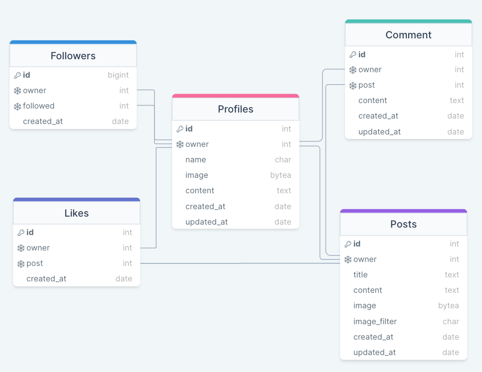

# Snap Tap App API :desktop_computer:

## The Live link can be found here -> [Snap Tap App API](https://snaptapapp-api.herokuapp.com/)


### Frontend Project Links

- [Frontend - Repository](https://github.com/niclastanskanen/project-5-react)
- [Frontend - Deployment](https://snaptapapp.herokuapp.com/)

<hr>

## Table of Contents

- [Database Schema](#database-schema)
- [Testing](#testing)
- [Technologies Used](#technologies-used)
  - [Languages and Frameworks Used](#languages-and-frameworks-used)
  - [Python Modules Used](#python-modules-used)
  - [Packages Used](#packages-used)
  - [Programs and Tools Used](#programs-and-tools-used)
- [Deployment](#deployment)
  - [Forking the GitHub Repository](#forking-the-github-repository)
  - [Making a Local Clone](#making-a-local-clone)
  - [Deploying with Heroku](#deploying-with-heroku)
- [Credits](#credits)
  - [Online resources](#online-resources)
  - [Code](#code)
  - [Acknowledgments](#acknowledgments)

<hr>

## Database Schema



## Testing

<details><summary>Manual Testing</summary>

## Manual Testing

As part of the API development, manual testing was performed to ensure that features worked as intended. It involved visiting each URL to ensure accurate results were returned, creating, updating, and deleting items as appropriate:

| URL | Passed |
|---|---|
| root | :white_check_mark: |
| /profiles/ | :white_check_mark: |
| /profiles/\<id>/ | :white_check_mark: |
| /posts/ | :white_check_mark: |
| /posts/\<id>/ | :white_check_mark: |
| /comments/ | :white_check_mark: |
| /comments/\<id>/ | :white_check_mark: |
| /likes/ | :white_check_mark: |
| /likes/\<id>/ | :white_check_mark: |
| /followers/ | :white_check_mark: |
| /followers/\<id>/ | :white_check_mark: |

## Code Validation

The `pycodestyle` package was used to validate the project against the PEP8 Style Convention during development. No validation errors were found in the final deployed when validating files that were **not** automatically generated (e.g. validation excludes the 'settings.py' file and migration files).

</details>

<hr>

## Technologies Used

### Languages and Frameworks Used

- [Python](https://www.python.org/)
- [Django](https://pypi.org/project/Django/3.2.14/)
- [Django-REST-framework](https://www.django-rest-framework.org/) - Toolkit for building web API's with Django.

### Python Modules Used

- Built-in Packages/Modules
  - [os](https://docs.python.org/3/library/os.html) - This module provides a portable way of using operating system dependent functionality.

### Packages Used

- External Python Packages
  - [cloudinary](https://pypi.org/project/cloudinary/) - Cloudinary intergration.
  - [django-cloudinary-storage](https://pypi.org/project/django-cloudinary-storage/) - Cloudinary intergration.
  - [dj-database-url](https://pypi.org/project/dj-database-url/) - Allows the use of 'DATABASE_URL' environmental variable in the Django project settings file to connect to a PostgreSQL database.
  - [django-allauth](https://pypi.org/project/django-allauth/) - Set of Django application used for account registration, management and authentication.
  - [dj-rest-auth](https://pypi.org/project/dj-rest-auth/) - API endpoints for handling authentication in Django Rest Framework.
  - [django-filter](https://pypi.org/project/django-filter/) - Application that allows dynamic QuerySet filtering from URL parameters.
  - [djangorestframework-simplejwt](https://pypi.org/project/djangorestframework-simplejwt/) - JSON Web Token authentication backend for the Django REST Framework.
  - [django-cors-headers](https://pypi.org/project/django-cors-headers/) - Django App that adds CORS headers to responses.
  - [gunicorn](https://pypi.org/project/gunicorn/) - Python WSGI HTTP Server.
  - [Pillow](https://pypi.org/project/Pillow/) - Fork of PIL, the Python Imaging Library which provides image processing capabilities.
  - [psycopg2](https://pypi.org/project/psycopg2) - Python PostgreSQL database adapter.


### Programs and Tools Used

- [drawSQL](https://drawsql.app/) - Create Database Schema/ERD
- [GitPod](https://www.gitpod.io/)
- [GitHub](https://github.com/)

<hr>

## Deployment

### Forking the GitHub Repository

By forking the GitHub Repository we make a copy of the original repository on
our GitHub account to view and/or make changes without affecting the original
repository by using the following steps...

1. Log in to GitHub and locate the [GitHub
   Repository](https://github.com/niclastanskanen/project-5-api)
1. At the top of the Repository (not top of page) just above the "Settings"
   Button on the menu, locate the "Fork" Button.
1. Click the button (not the number to the right) and you should now have a copy
   of the original repository in your GitHub account.

### Making a Local Clone

**NOTE**: It is a requirement of the project that you have Python version 3.8 or higher installed locally.

1. Log in to GitHub and locate the [GitHub Repository](https://github.com/niclastanskanen/project-5-api).
1. Under the repository name, click "Code".
1. To clone the repository using HTTPS, under "HTTPS", copy the link.
1. Open your local terminal with git installed
1. Change the current working directory to the location where you want the cloned directory to be created.
1. Type `git clone`, and then paste the URL you copied in Step 3.

    ```console
    ~$ git clone https://github.com/niclastanskanen/project-5-api
    ```

1. Press Enter. Your local clone will be created.

    ```console
    $ git clone https://github.com/niclastanskanen/project-5-api
    > Cloning into `test-dir`...
    > remote: Counting objects: 10, done.
    > remote: Compressing objects: 100% (8/8), done.
    > remove: Total 10 (delta 1), reused 10 (delta 1)
    > Unpacking objects: 100% (10/10), done.
    ```

    [Click here](https://help.github.com/en/github/creating-cloning-and-archiving-repositories/cloning-a-repository#cloning-a-repository-to-github-desktop) for a more detailed explanation of the process above with pictures.

1. Change the current working directory to the cloned project folder (this will be a child directory in the location you cloned the project).

1. It is recommended to use a virtual environment during development ([learn more about virtual environments](https://realpython.com/python-virtual-environments-a-primer/)). If you would prefer not to use one please skip the following steps:
    1. Create a virtual environment in the projects working directory by entering the following command in the same terminal window used for the steps above `python3 -m venv .venv`.
    1. Before use, the virtual environment will need to be activated using the command `source .venv/bin/activate` in the same terminal window used previously.
1. Packages required by the project can now using the command `pip install -r requirements.txt`
1. In the cloned directory, rename the file `.env-example` to `.env` and populate it with the information required.
1. Make Django migrations using the command `./manage.py migrate`.

### Deploying with Heroku

**NOTE**: It is a prerequisite of deployment to Heroku that you already have access to the following:

- A Cloudinary account, create one for free at [https://cloudinary.com](https://cloudinary.com).

**NOTE**: It is assumed you have followed all deployment instructions listed in this readme starting with the section titled 'Forking the GitHub Repository'.

1. Log in to [Heroku](https://www.heroku.com/) and if not taken there automatically, navigate to your personal app dashboard.
1. At the top of the page locate the 'New' drop down, click it and then select 'Create new app'.
1. Give your application a unique name, select a region appropriate to your location and click the 'Create app' button.
1. Your app should now be created, so from the menu towards the top of the page select the 'Resources' section.
1. Search for 'Heroku Postgres' under the Add-ons section and add it.
1. From the menu towards the top of the page select the 'Settings' section and lick 'Reveal Config Vars' in the Config vars section. Enter the following key / value pairings:
    1. Key as `ALLOWED_HOSTS` and the value as the name of you project with '.herokuapp.com' appended to the end e.g.  `example-app.herokuapp.com`. Click the Add button.
    1. Key as `CLOUDINARY_URL` and the value as your cloudinary API Environment variable e.g. `cloudinary://**************:**************@*********`. Click the Add button.
    1. Key as `SECRET_KEY` and the value as a complex string which will be used to provide cryptographic signing. The use of a secret key generator is recommended such as [https://djecrety.ir](https://djecrety.ir/). Click the Add button.
    1. Ensure the key `DATABASE_URL` is already populated. This should have been created automatically by Heroku.
    1. The `DATABASE_URL` should be copied into your local `.env`, created during the cloning process.
    1. To make authenticated requests to this API (e.g. from a fontend application) you are required to add the key `CLIENT_ORIGIN` with the value set as the URL you will be sending the authentication request from.
    1. Additionally, a `CLIENT_ORIGIN_DEV` key can be set with the value of a development server (IP or URL) for use during local development.
1. Open the `.env` file in the project directory and delete the key / value pair `DEV_ENVIRONMENT_DATABASE = True` before saving the file. This can be added back after the next step to ensure local development changes will not alter the remote database.
1. Navigate to the 'Deploy' page using the menu towards the top of the page.
1. Select 'GitHub' from the 'Deployment method' section and you will be prompted to 'Connect to GitHub'.
1. Once connected to your GitHub account you will be able to search for your repository which contains the forked 'property-direct-backend' repository.
1. Once the repository is found click 'Connect'.
1. At the bottom of the page find the section named 'Manual deploy', select the 'main' branch in the drop down and click the 'Deploy' button.
1. Once deployment is complete, click the 'View' button to load the URL of the deployed application.

<hr>

## Credits

### Online resources

- [Django Documentation](https://docs.djangoproject.com/en/4.1/)
- [Django REST Documentation](https://www.django-rest-framework.org/)
- [Python Documentation](https://docs.python.org/3/)

### Code

- Code Institute DRF Tutorial Project
  - CREDIT: Code Institute DRF-API Tutuorial Project
  - URL: [https://github.com/Code-Institute-Solutions/drf-api](https://github.com/Code-Institute-Solutions/drf-api)

### Acknowledgments


